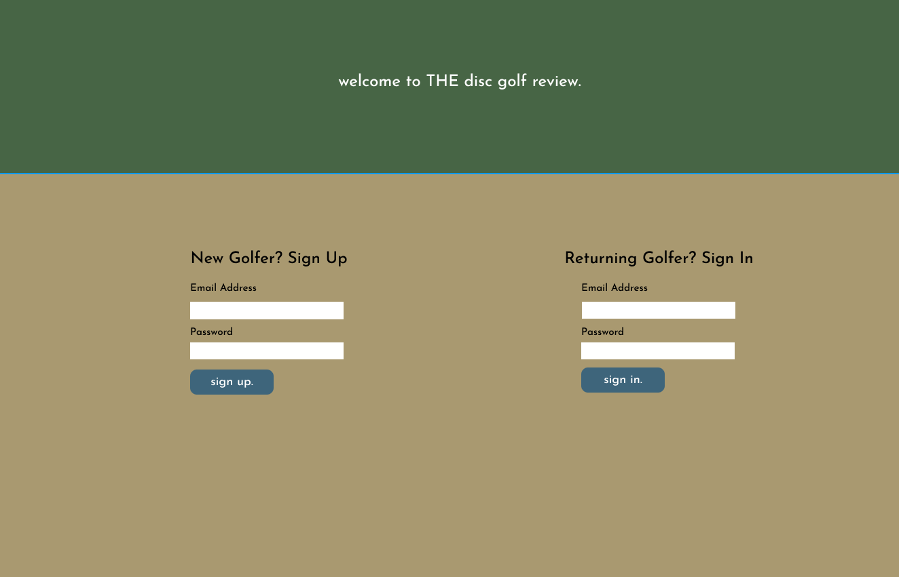
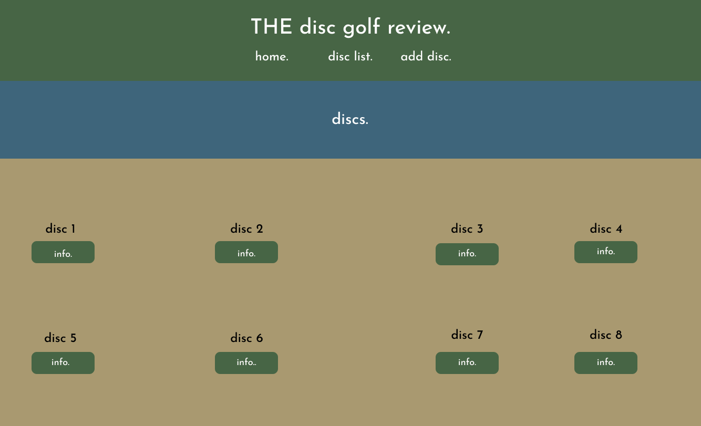
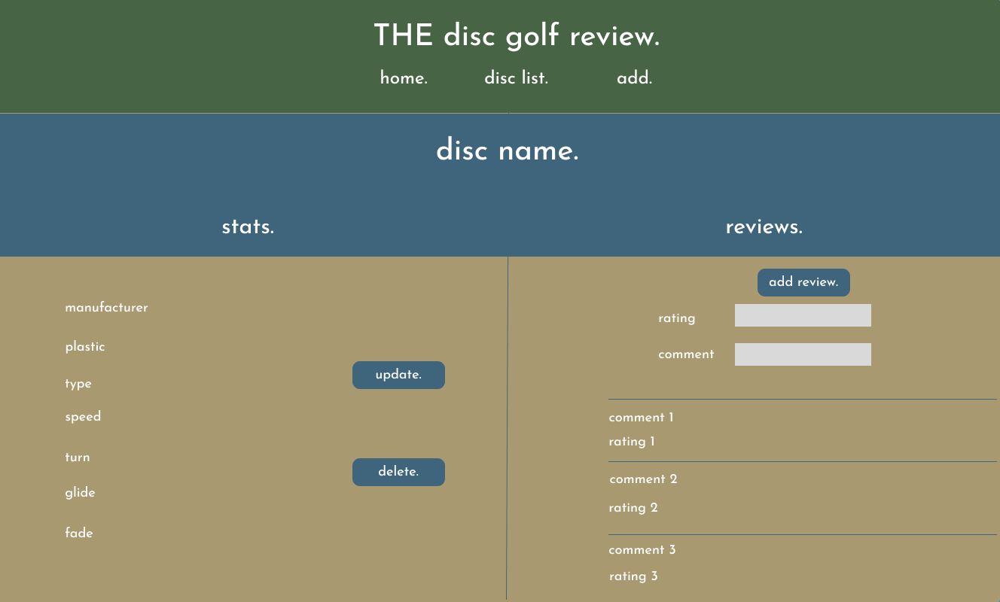
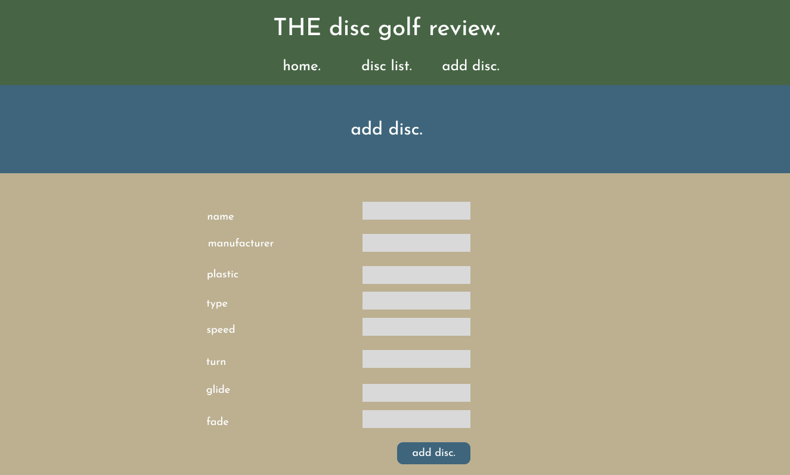
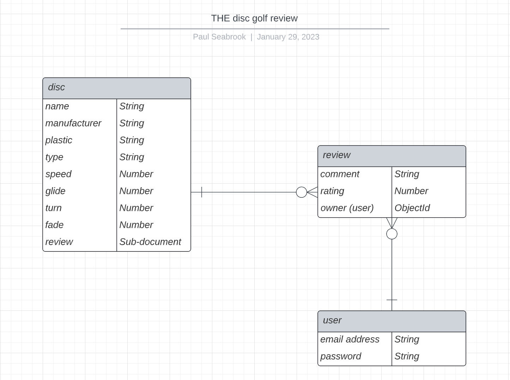

# project-2 - THE disc golf review

## Wireframe

##

---

## MVP

### As a user, I want to:

- Be able to sign up with email address and password.
- Once signed up, be able to sign in with email address and password.
- See a list of discs once signed-in.
- Be able to click "add disc." and see a new "screen" where I can add a disc with its various stats.
- Be able to click "disc list" to see the list of discs.
- Be able to click on a disc's "info".
- Once the info is clicked for a particular disc, be able to see the stats on that disc and different comments and ratings for that disc.
- Be able to delete a disc.
- Be able to update a disc.
- Once on the stats and review page and if signed in, I want to be able to add a rating and comment for that particular disc.
- Be able to click "home." and go back to the sign-up/sign-in "screen".

---

## Version 2

### As a user, I want to:

- Have the ability to add links to sites where I can purchase the disc.
- Have the ability to add a picture of the disc.
- Be able to delete and update "reviews".
- See which user left the "review".
- See an "About" section.

---

## Version 3

### As a user, I want to:

- Be able to add a professional disc golfer as a collection with a one to many relationship with different discs.
- Be able to filter the discs by type (putter and approach, midrange, fairway driver, distance driver).

---

## Entity Relationship Diagram

